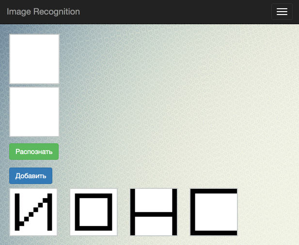

Hopfield network - image recognition
===============================
**Progress:**

Set a number of images. The input is a certain image that you want to define on which the image in the memory like a given.
The input image is a square 5 * 5 cell. Each cell can be either black or white. To supply the input image in a neural network is created vector 1 * 25, consisting of +1 and -1. If the cell is black color, the vector element value is 1, otherwise -1.

**The projection method**

Projection technique was used to obtain the matrix of neural network weights. It allows you to calculate the weights as follows:
_W = X (XTX) -1XT_

Where X - matrix of size N x q, composed of sample vectors,
W - matrix of weighting coefficients _N x N_.

**Justification of the method:**

It is assumed that when passing through a trained network of any vector of the sample at the output we get the same vector.
That is: _WX = X_ According to the properties of the pseudoinverse: _AA + A = A_, thus: _W = XX+_

When the linear independence of the columns of the matrix X, ie sample vectors, may be the next method of calculating the pseudo-inverse matrix:
_X + = (XTX) -1XT_
Thus: _W = X (XTX) -1XT_

**Recognition takes place according to the following algorithm:**

1. At the entrance of the neural network is supplied vector X.
2. Calculated output _𝑌 = 𝑋 * 𝑊_ neural network
3. If the vector X to coincide with the output (the network is in steady state), the input image is identified, else go to step 1, where the input vector will be equal to the output of the neural network at this stage.

**Example**

The neural network trained to recognize four images.

